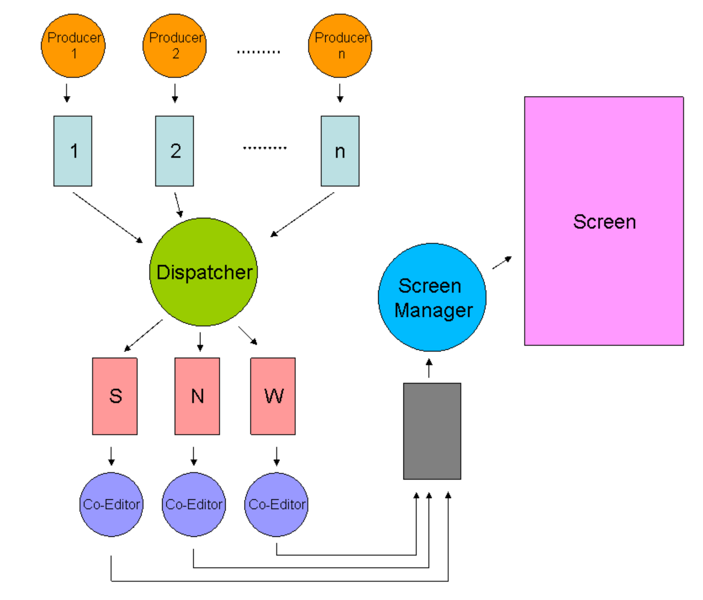

# Concurrent Programming and Synchronization Mechanisms Assignment


**Submission Due Date: 26.06.25 23:59:00**

### General Description

The aim of this assignment is to develop skills in concurrent programming and synchronization mechanisms. It's crucial to design the solution carefully before starting the implementation. Otherwise, the implementation may be very challenging.

This scenario also helps understand the performance impact of various synchronization constructs under different loads.

The scenario we're simulating is news broadcasting. Different types of stories are produced, and the system sorts and displays them to the public.

In this assignment, 'news stories' are represented by simple strings that should be displayed on the screen in the order they arrive.

In the scenario you should implement, there are 4 types of active participants:

#### Producer

Each producer creates several strings in the following format:

```
“producer <i> <type> <j>”
```

- `<i>`: Producer's ID
- `<type>`: A random type chosen from `SPORTS`, `NEWS`, `WEATHER`
- `<j>`: The number of strings of type `<type>` this producer has already produced

The number of products a producer makes is specified via its constructor.

For example, if producer 2 needs to create 3 strings, a possible outcome could be:

```
Producer 2 SPORTS 0
Producer 2 SPORTS 1
Producer 2 WEATHER 0
```

Each producer sends its information to the Dispatcher (introduced below) via its own private queue. Each producer's private queue is shared between the Producer and the Dispatcher. Each of the string products is inserted by the Producer into its 'producer queue'. After inserting all the products, the Producer sends a 'DONE' string through its queue.

#### Dispatcher

The Dispatcher continuously accepts messages from the producers' queues. It scans the producers' queues using a Round Robin algorithm. The Dispatcher does not block when the queues are empty. Each message is "sorted" by the Dispatcher and inserted into one of the Dispatcher queues, which include strings of a single type. When the Dispatcher receives a "DONE" message from all producers, it sends a "DONE" message through each of its queues.

- **SPORTS**: Inserted into the "S dispatcher queue"
- **NEWS**: Inserted into the "N dispatcher queue"
- **WEATHER**: Inserted into the "W dispatcher queue"

#### Co-Editors

For each type of possible message, there is a Co-Editor that receives the message through the Dispatcher’s queue, "edits" it, and passes it to the screen manager via a single shared queue. The editing process is simulated by the Co-Editors by blocking for one-tenth (0.1) of a second. When a Co-Editor receives a "DONE" message, it passes it without waiting through the shared queue.

#### Screen Manager

The Screen Manager displays the strings it receives via the Co-Editors' queue to the screen (standard output). After printing all messages to the screen and receiving three "DONE" messages, the Screen Manager displays a 'DONE' statement.

### System Design

The system should be implemented according to the following chart:



Three producers communicate with the dispatcher via their Producer queues. The Dispatcher communicates with the Co-Editors via three queues corresponding to the three types of messages. The Co-Editors communicate with the Screen-Manager via a single shared queue, and the Screen-Manager displays the system's output.

### Bounded Buffer

The Producer queues in this assignment and the Co-Editors' shared queue are a bounded buffer that supports the following operations:
- **Bounded_Buffer (int size)**: Constructor that creates a new bounded buffer with `size` places to store objects.
- **void insert (char * s)**: Inserts a new object into the bounded buffer.
- **char * remove ()**: Removes the first object from the bounded buffer and returns it to the user.

You must implement a thread-safe bounded buffer. To do this, you will be provided with a binary semaphore (mutex) and need to create a counting semaphore with two binary semaphores as studied in class. The implementation of a 'bounded buffer' synchronization mechanism, with two counting semaphores and one binary semaphore, was presented in class.

### Configuration File

The configuration file should have the following format:

```
PRODUCER 1
[number of products]
queue size = [size]

PRODUCER 2
[number of products]
queue size = [size]

...
...

PRODUCER n
[number of products]
queue size = [size]

Co-Editor queue size = [size]
```

For example, the following are legal configuration files:

```
PRODUCER 1
30
queue size = 5

PRODUCER 2
25
queue size = 3

PRODUCER 3
16
queue size = 30

Co-Editor queue size = 17
```

### Submission Requirements

- **Language:** This assignment must be written in C or C++ (C++ is preferred belive me).
- **Submission Format:** Submit a zip file named `ID.zip` (e.g., 123456.zip).
- **Contents:** The zip file must contain all C files, a header file, and a Makefile.
- **Executable Name:** The executable file created by the Makefile must be named `ex3.out`.
- **Executable File:** Do not include the executable (binary) file in your submission.
- **Configuration File:** Your program will receive the name of the configuration file from the command line.

**For example:**
```
ex3.out config.txt
```

For questions, use the forum on the Moodle!

**Good Luck.**
:)
